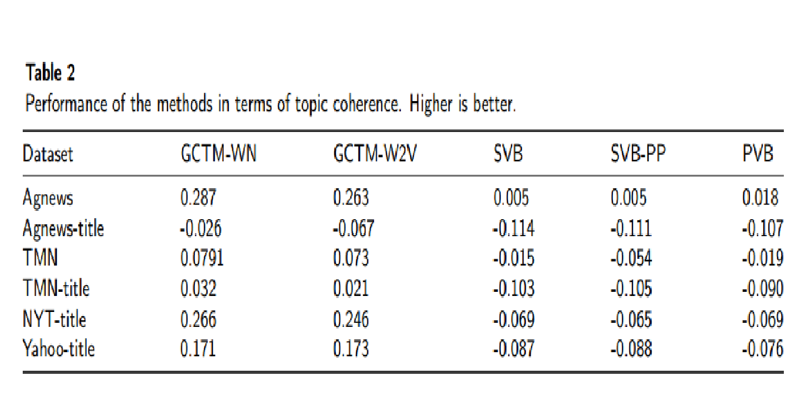

# GCTM
This is an implementation of [Graph Convolution Topic Model](link) (GCTM) which exploits an external knowledge graph in a streaming environment. In this work, we use graph convolutional networks (GCN) to embed the knowledge graph in topic space. We also develop a method to learn GCTM in data streams. Some benefits of GCTM are follows:

*	GCTM exploits a knowledge graph, which is derived from human knowledge or a pre-trained model, to enrich a topic model for data streams, especially in case of sparse or noisy data. We emphasize that our work first provides a way to model prior knowledge of graph form in a streaming environment
*	We also propose an automatic mechanism to balance between the prior knowledge and old knowledge learnt in the previous minibatch. This mechanism can automatically control the impact of the prior knowledge in each minibatch. When concept drift happens, it can automatically decrease the influence of the old knowledge but increase the influence of the prior knowledge to help GCTM deal well with the concept drift.

## Installation
1. Clone the repository
```
		https://github.com/bachtranxuan/GCTM.git
``` 
2. Requirements environment
```
		Python 3.7
		Pytorch 1.2.0
		Numpy, Scipy
```
## Training
You can run with command
```
	python runGCTM.py
```
## Data descriptions
Data for training consists of an external knowledge graph and a set of documents.
*	In terms of knowledge graph, we experiment on both [WordNet](https://wordnet.princeton.edu/)) and a pre-trained graph ([Word2vec](https://nlp.stanford.edu/projects/glove/))). For Wordnet, we use both synonym and antonym relationships between words to create edges and the weight of each edge is the Wu-Palmer similarity of the corresponding pair of words. For the pre-trained graph, we create a 200-nearest neighbour graph based on cosine similarity between Word2vec representations of words. The two graphs are saved in files: data/edgesw.txt and data/edges_knn200.txt respectively. Each line represents an edge and is of the form:
```
vertex_id1 \tab vertex_id2 \tab weight 
```
*	We use the bag-of-words model to represent documents. Each document is represented by a sparse vector of word counts. Data ís saved in a file (data/train.txt) in which each row is a document representation in form:
```
[M] [term_id1]:[count] [term_id2]:[count] ... [term_idN]:[count]
```

	where [M] is the total of unique terms and the [count] is the word counts of each corresponding term in the document.  We note that both vertex_id and term_id refer to word_id in the vocabulary (data/vocab.txt).

Each document in the test set is divided randomly into two disjoint part (part_1) and (part_2) with a ratio of 4:1. We compute the predictive probability of part_2 when given part_1. The two parts are saved in two files: data/data_test_1_part_1.txt and data/data_test_1_part_2.txt respectively.  Their forms are the same as the training data file.

### Performance Measure:
We use log predictive probability ([LPP](http://jmlr.org/papers/v14/hoffman13a.html))  and Normalized pointwise mutual information ([NPMI](https://www.aclweb.org/anthology/E14-1056/)) to measure performance. While LPP is computed on the test set after training the model on each minibatch, NPMI is calculated on the whole training set after finishing training process.  

## Result
We compare our model with three state-of-the-art base-lines:
SVB ([Broderick et al., 2013](https://arxiv.org/pdf/1307.6769.pdf)), PVB ([McInerney et al.,  2015](https://arxiv.org/pdf/1507.05253.pdf)) and SVP-PP ([Masegosa et al., 2017](http://proceedings.mlr.press/v70/masegosa17a/masegosa17a.pdf)). We conduct intensive experiments with several scenarios that are described more explicitly in the paper. Here are some results.



## Citation
if you find that TPS is useful for your research, please citing:
```
@article{*,
  title={Graph Convolution Topic Model for Data Streams},
  author={*},
  journal={arXiv preprint arXiv},
  year={2020}
}
```
