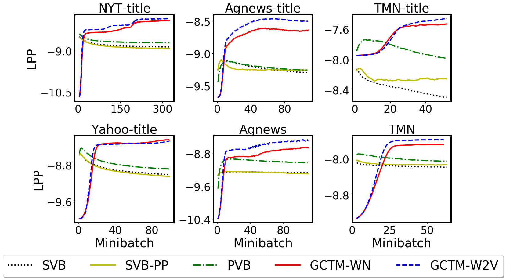

# GCTM
This is an implementation of Graph Convolution Topic Model for Data Streams

## Installation
1. Clone the repository
```
		https://github.com/bachtranxuan/GCTM.git
``` 
2. Requirements environment
```
		Python 3.7
		Pytorch 1.2.0
		Numpy, Scipy
```
## Training
You can run with command
```
	python runGCTM.py
```
## Data descriptions
*  Training file, we used the bag of words format.
* Testing folder (E.g data).
* Graph, we saved by format: node1 \tab node2 \tab weight (E.g data/edgesw.txt). while node2 has a relationship (E.g synonym or antonym ) with node1 and the weight of each edge is computed by Wu-Palmer or Cosine similarity.
## Model
Graphical representation for GCTM is illustrated below
\

## Result
We compare our model with three state-of-the-art base-lines:
SVB ([Broderick et al., 2013](https://arxiv.org/pdf/1307.6769.pdf)), PVB ([McInerney et al.,  2015](https://arxiv.org/pdf/1507.05253.pdf)) and SVP-PP ([Masegosa et al., 2017](http://proceedings.mlr.press/v70/masegosa17a/masegosa17a.pdf)). Log predictive probability ([LPP](http://jmlr.org/papers/v14/hoffman13a.html))  and Normalized pointwise mutual information ([NPMI](https://www.aclweb.org/anthology/E14-1056/))


``` 
